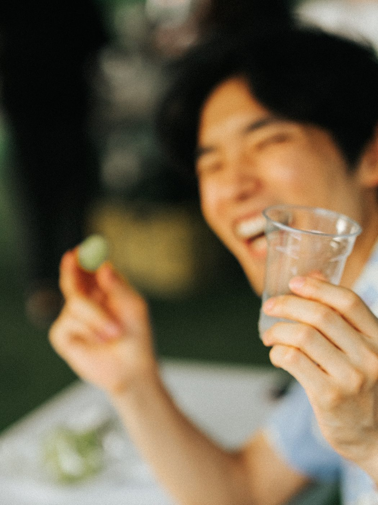
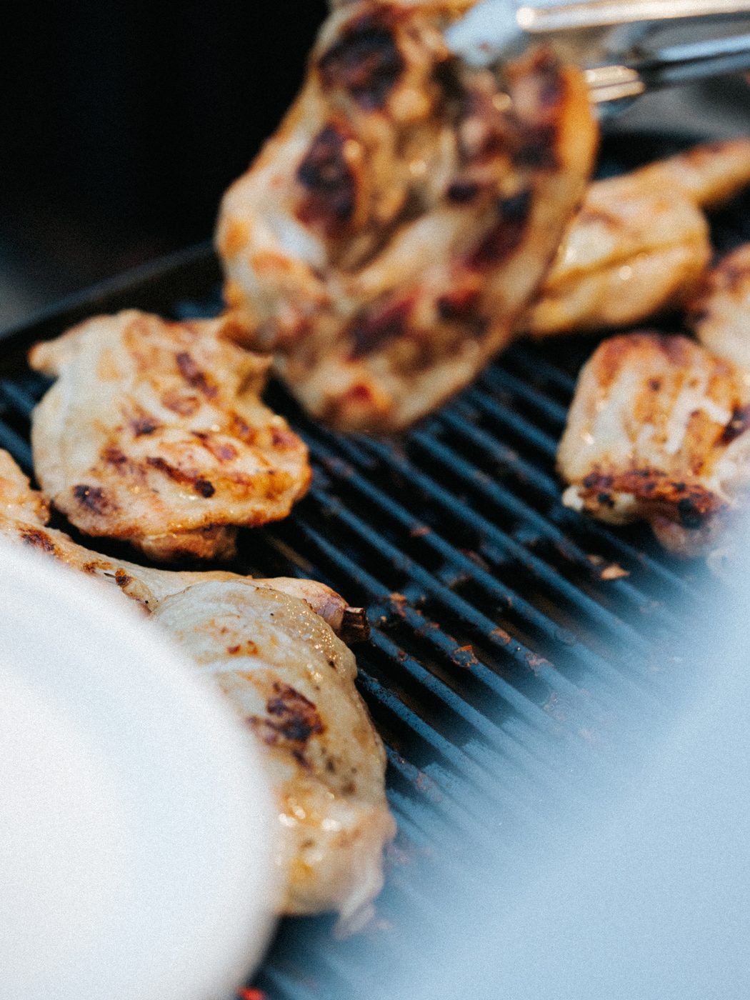
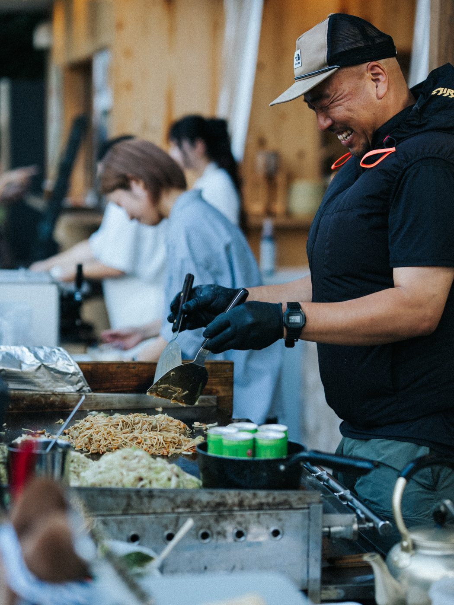
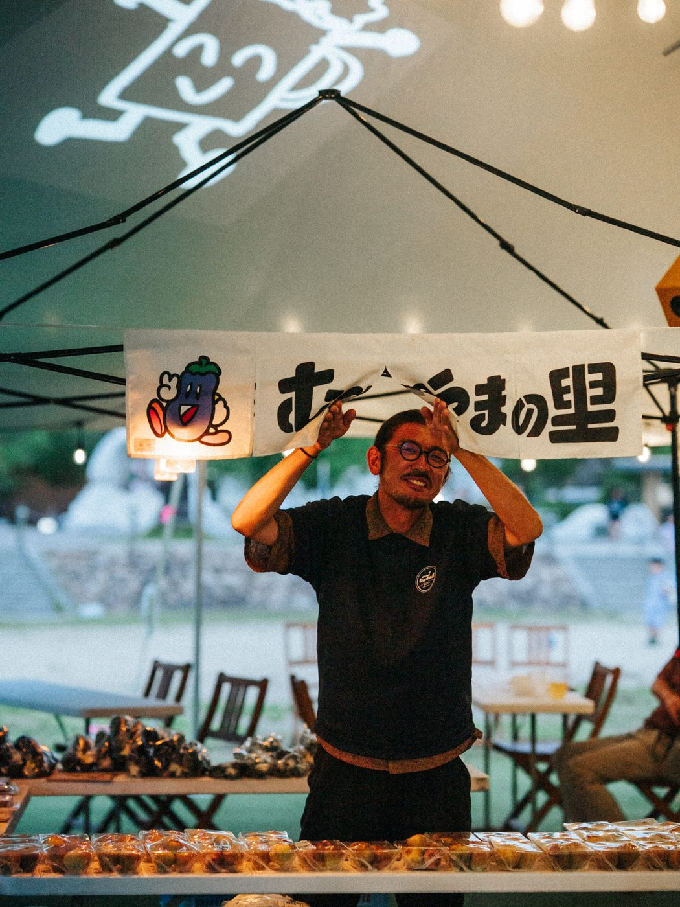
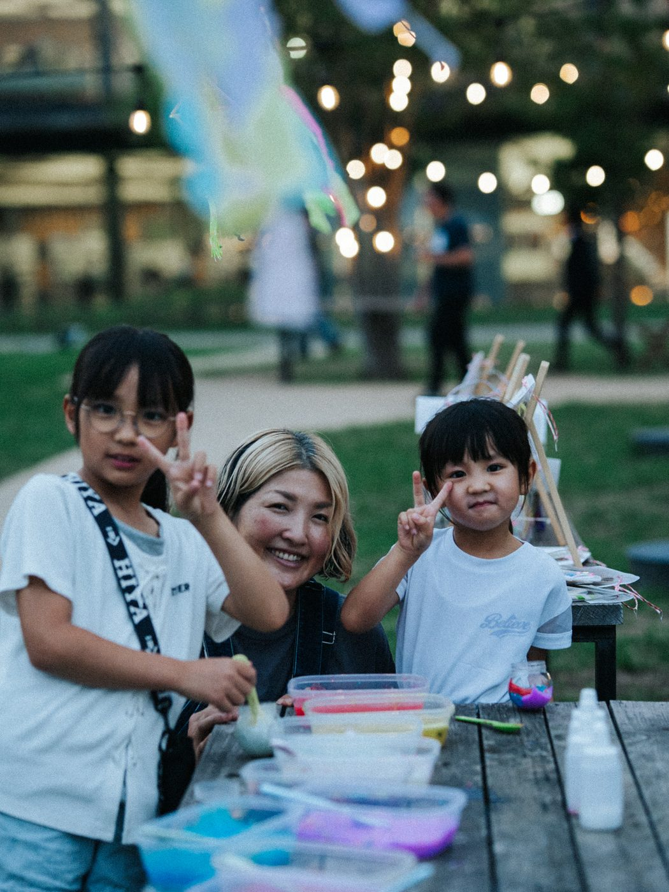
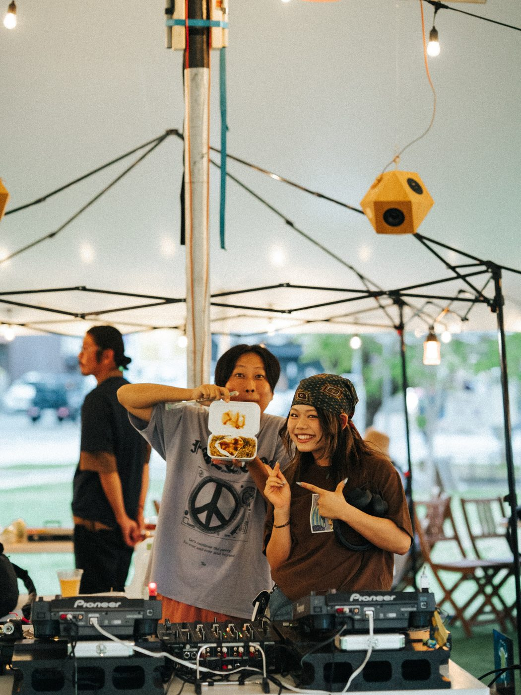
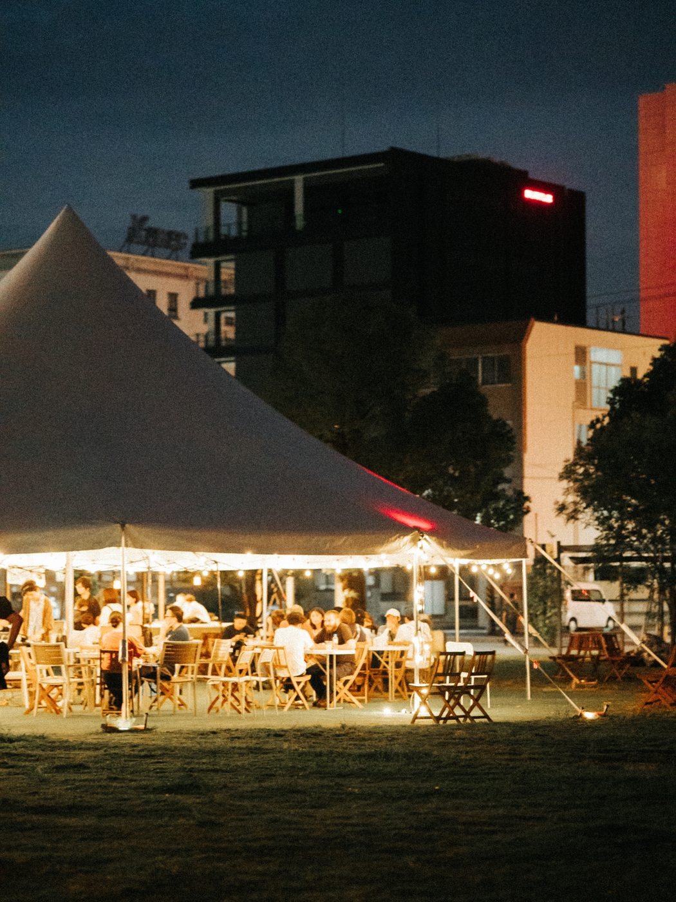
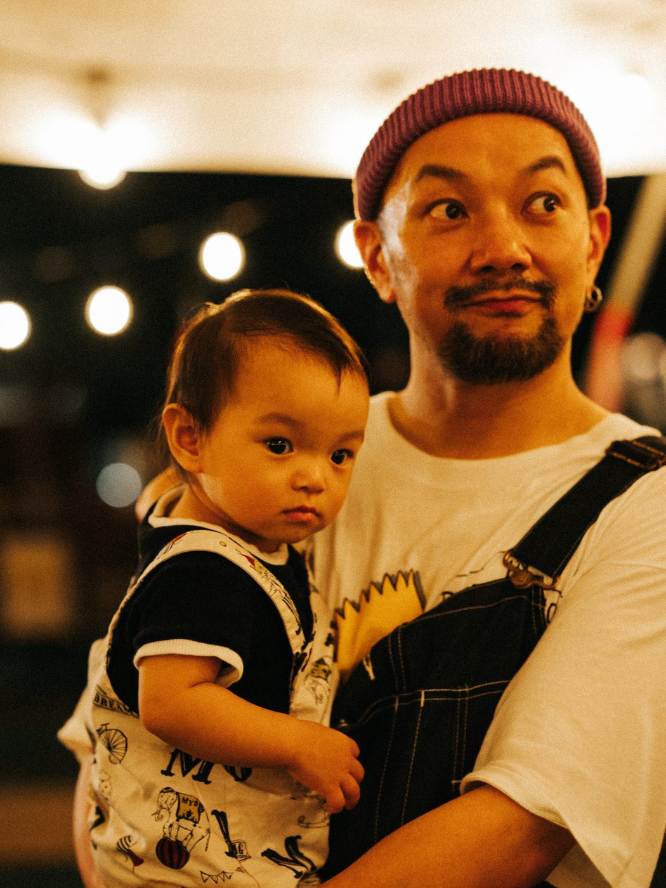

2026年9月12日（土）、福山中央公園で「夏の終わりのビアガーデン」を開催しました。夏の暑さがやわらぎはじめた夕方から夜にかけての3時間、芝生の公園が夕涼みのビアガーデンになりました。

**約250名**の方にお越しいただきました。

## 開催の記録

| 項目 | 内容 |
|---|---|
| 日時 | 2026年9月12日（土）17:00〜20:00 |
| 会場 | 福山中央公園（人工芝エリア・大型テント） |
| 入場 | 無料・予約不要 |
| 主催 | Good Day Neighbors |
| 出店 | Enlee／福山やきそば 村かず／むべやまの里／みっけ こどものアトリエ |
| 音楽 | Nurumayu Yoshida ／ Takumi ／ Onigirino ／ Ohira |
| 来場者数 | 約250名 |

> 来場者数は当日の目視によるおおよその人数です。正確な入場カウントは行っていません。

## ハッピーアワーの生ビール

17:00〜19:00のハッピーアワーは、生ビール1杯¥400（税込）でご提供しました。

日が高いうちからお越しいただいた方が多く、**この2時間に注文が集中**しました。仕事帰りに、散歩の途中に、まず1杯。そんな時間の過ごし方をしていただけたようです。

## フードとドリンク

Enleeからは、ミスジと農園野菜のBBQ串、あぶり焼きチキン、おつまみの盛り合わせ。むべやまの里の完熟いちじくと、はっとりほたるの里のすだちを使ったかき氷もご用意しました。

福山やきそば 村かずの鉄板焼きそばは、ビールとの相性で人気でした。串・チキン・おつまみを組み合わせて注文される方が多く、**飲みものだけでなく「食べるもの」も目当てにお越しいただけた**ようです。

## むべやまの里

むべやまの里からは、旬の完熟いちじくと産直野菜が届きました。かき氷に使ったいちじくも、この日の朝に届いたものです。

## こどものワークショップ

みっけ こどものアトリエによるスライムバイキングとこどもクラフトキット。今回も多くのお子さまにご参加いただきました。

夕方から夜にかけての時間帯ですが、**お子さま連れのご家族がいちばん多い時間**でもあります。大人はビール、子どもはワークショップ、という過ごし方が定着してきました。

## 音楽

サーカステントの中にはDJブース。日が暮れていく公園に、心地よい音楽が流れていました。

**GOOD MUSIC SELECTOR**　Nurumayu Yoshida ／ Takumi ／ Onigirino ／ Ohira

## 日が暮れてから

19時を過ぎると、テントの下に電球の灯りがともります。街なかの公園が、この日だけの場所に変わる時間です。芝生に腰を下ろして過ごす方、テーブルを囲む家族連れ、それぞれの時間が流れていきました。

7月のPARK PIZZA PARTY、8月のPARK FROZEN PARTYに続いて、**この夏3回目の夜の中央公園**です。回を重ねるごとに、「公園で夜を過ごす」という使い方が少しずつ根づいてきたように感じています。

## 次回に向けて

冬には、この中央公園でクリスマスマーケットを予定しています。詳細が決まりしだい、Instagram [@good_day_neighbors](https://www.instagram.com/good_day_neighbors) とこのサイトでお知らせします。

ご来場いただいたみなさま、出店・ご協力いただいたみなさま、ありがとうございました。

## 出店・ご協力を検討されている方へ

Good Day Neighborsでは、福山中央公園でのイベントに出店・ご協力いただける方を随時ご相談しています。当日の客層や運営体制、出店の条件については[出店・ご利用について](/join)をご覧ください。
