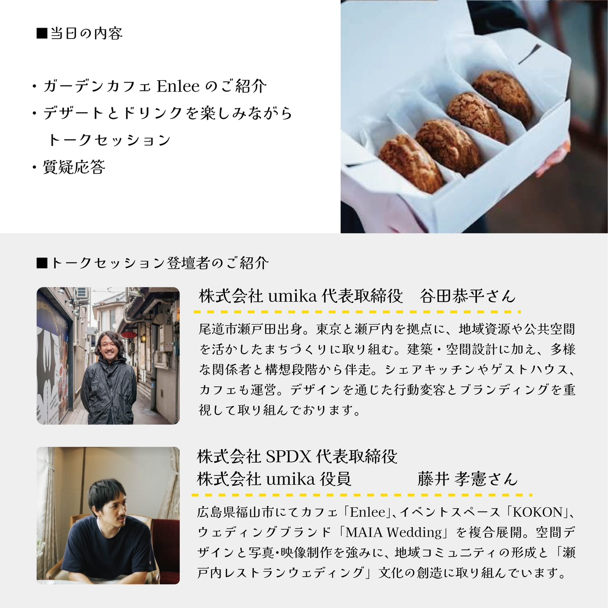
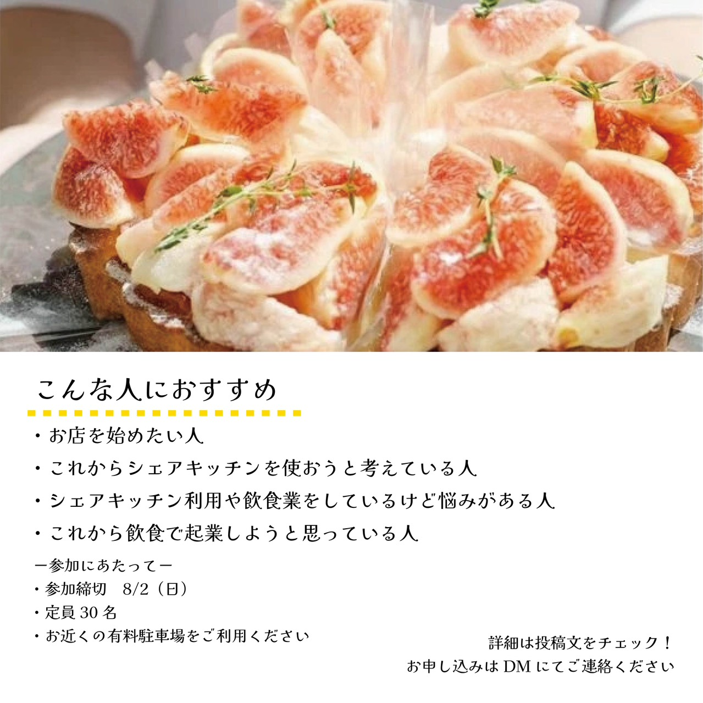

谷田さん（株式会社umika代表）が運営するシェアキッチン＆アトリエ「Little Setouchi」主催の座談会に、Enleeのオーナー・藤井孝憲がゲストとして登壇します。

## 開催概要

- テーマ: 「はじめるを試したあとに」
- 日時: 2026年8月6日（木）19:00〜20:30
- 会場: Enlee
- 会費: 2,000円（デザート・ドリンク付き）
- 定員: 30名
- 申込締切: 2026年8月2日
- 申込方法: Little Setouchi公式アカウントへDM

## 当日の内容と登壇者

## 座談会について

Little Setouchiは「はじめるを試せる（Try start）」をコンセプトにした、瀬戸内のシェアキッチン＆アトリエです。今回は第二回座談会として、地域で新しい挑戦を始めた後の話をテーマに、藤井が登壇します。

> 学びと憩いの公園——中央公園に関わる人を増やし、そこで行われる試みの情報が集まる場所にしていく。他団体の企画にGDNが関わることも、そのつながりの一つのかたちです。

## お申し込み

定員30名、申込締切は8月2日です。お申し込みはLittle Setouchi公式アカウントへDMでご連絡ください。
