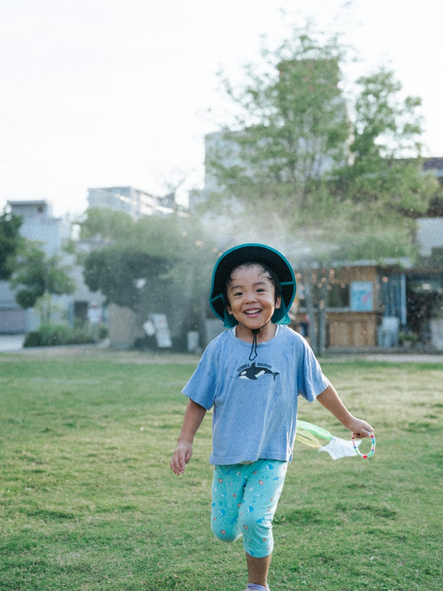
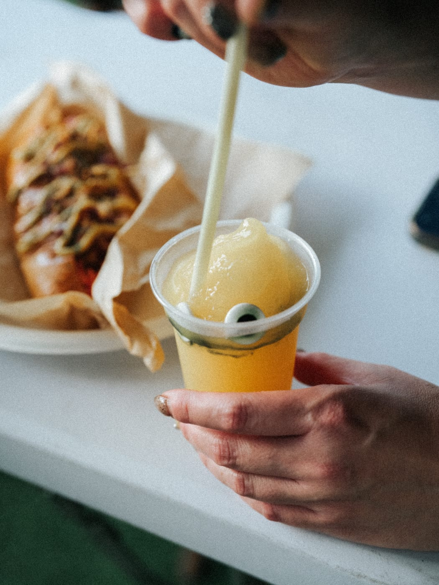
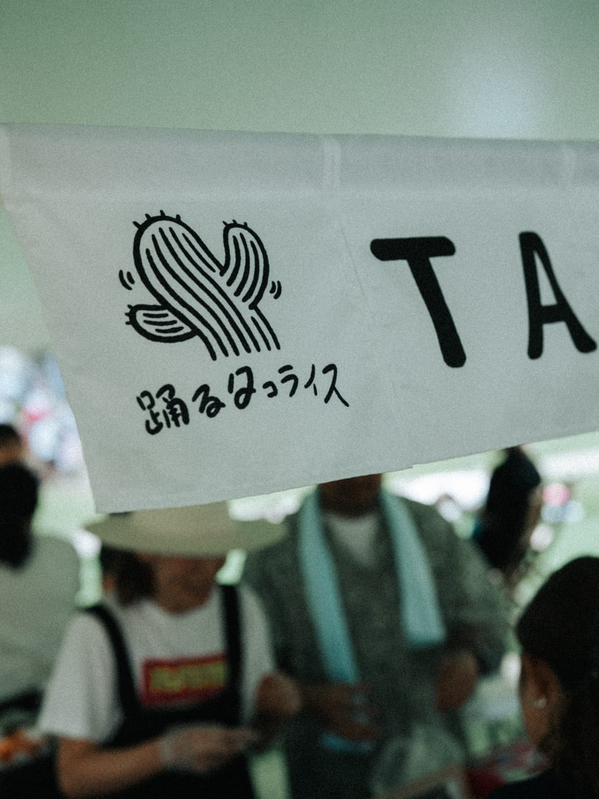
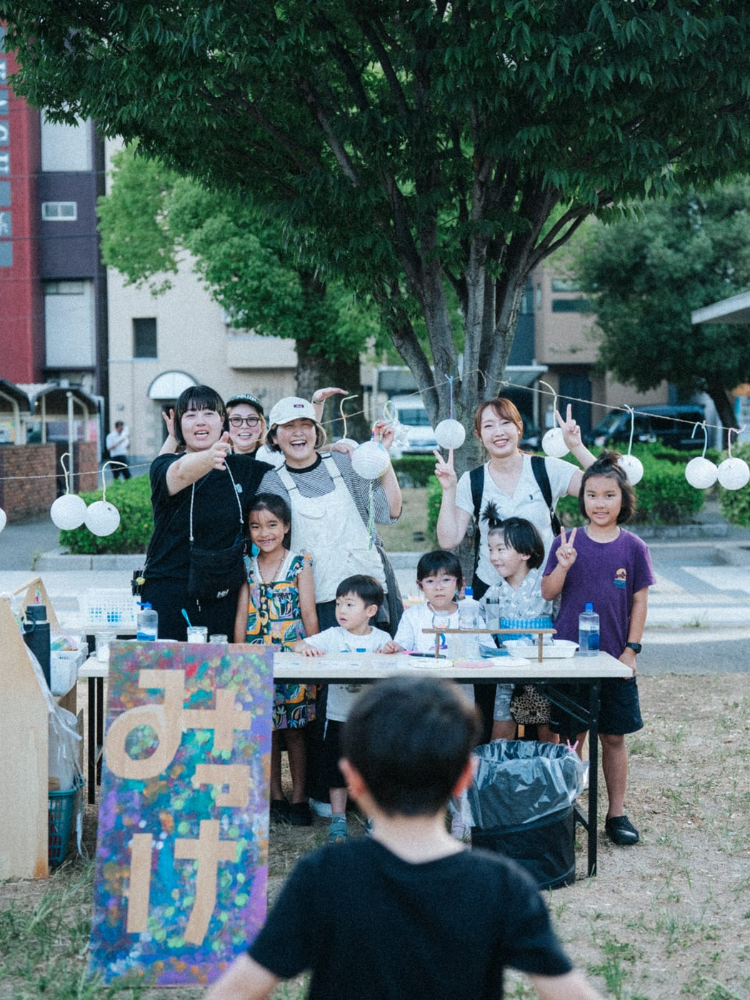
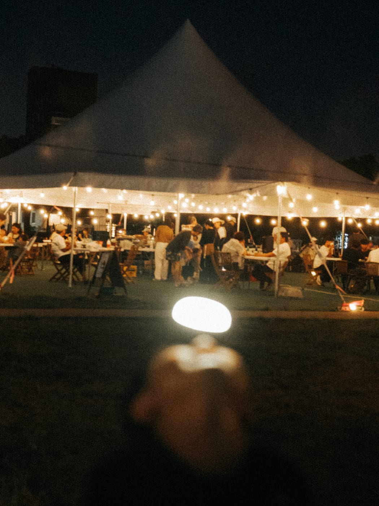

2026年8月1日（土）、福山中央公園で「PARK FROZEN PARTY」を開催しました。真夏の夕方、冷たいドリンクと音楽、そして水遊びで涼をとる、夏らしい一日です。

**推計で約250名**の方にお越しいただきました。

## 開催の記録

| 項目 | 内容 |
|---|---|
| 日時 | 2026年8月1日（土）17:00〜20:00 |
| 会場 | 福山中央公園（屋外・大型テント設営） |
| 主催 | Good Day Neighbors |
| 協力 | みっけ こどものアトリエ／DJ／よつば（縁日出店）／Enlee |
| 来場者数 | 推計 約250名 |

> 来場者数は、同時開催した子ども向けワークショップの参加者数（77名）をもとにした推計です。正確な入場カウントは行っていません。

## ミストとシャボン玉

日中の気温が高い時間帯からのスタートだったため、前回に続き**大型テントとミスト**を設営しました。

ミストは暑さ対策として設置したものですが、実際には**子どもたちの遊び場そのもの**になりました。霧の中を何度も走り抜ける姿があちこちで見られ、シャボン玉と合わせて、公園全体が遊べる空間になっていました。

## フローズンドリンクと出店

冷たいフローズンドリンクのほか、今回は**踊るタコライス**にご出店いただきました。

縁日の出店（よつば様）もあり、飲食と遊びの両方を楽しんでいただける構成になりました。

## 子ども向けワークショップ「よるあそび」

みっけ こどものアトリエによる「よるあそびワークショップ」を今回も同時開催しました。

- 光るスライム 500円
- ながれぼし 500円
- ほんわりランタン 1,500円

**77名**のお子さまにご参加いただきました。

## 日が落ちてから

日が落ちると、テントの下に灯りがともります。昼間の暑さがやわらぎ、涼しくなった芝生でゆっくり過ごす方が増えていきました。

7月18日のPARK PIZZA PARTYに続き、**夏に2回、中央公園で夜のイベントを開催**できたことになります。大型テントとミストという設備面の型ができたことで、次回以降も同じ形で運営していけそうです。

## 出店・ご協力を検討されている方へ

Good Day Neighborsでは、福山中央公園・KOKONでのイベントに出店・ご協力いただける方を随時ご相談しています。当日の客層や運営体制について詳しくお知りになりたい方は、GDN公式LINEよりお気軽にお問い合わせください。
