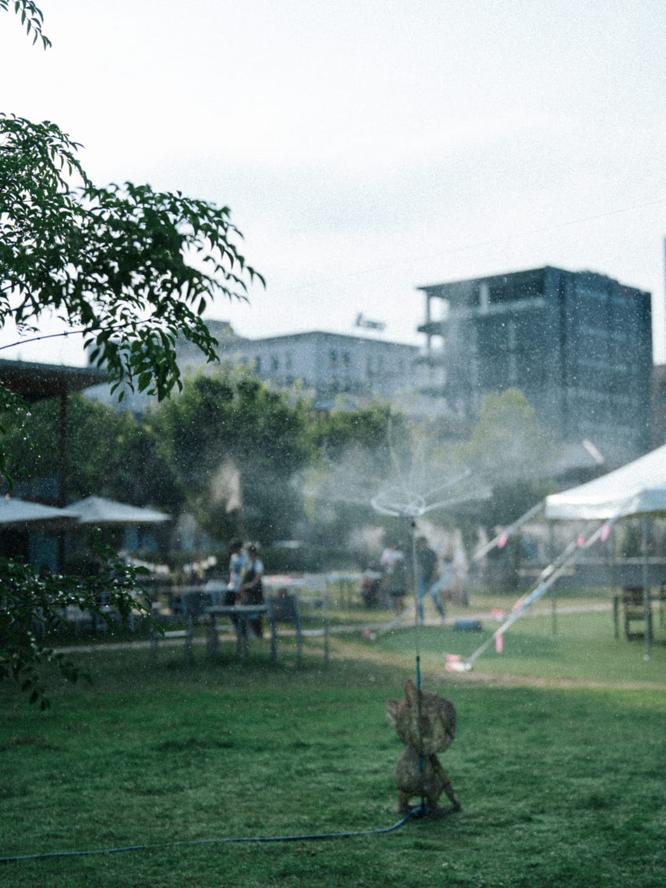
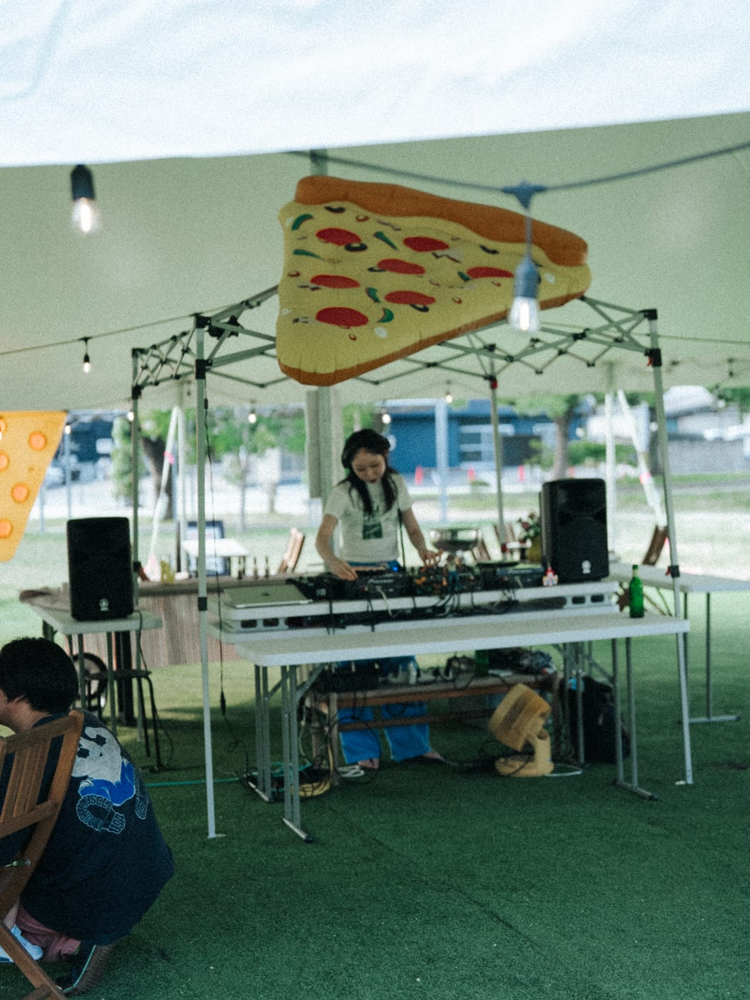
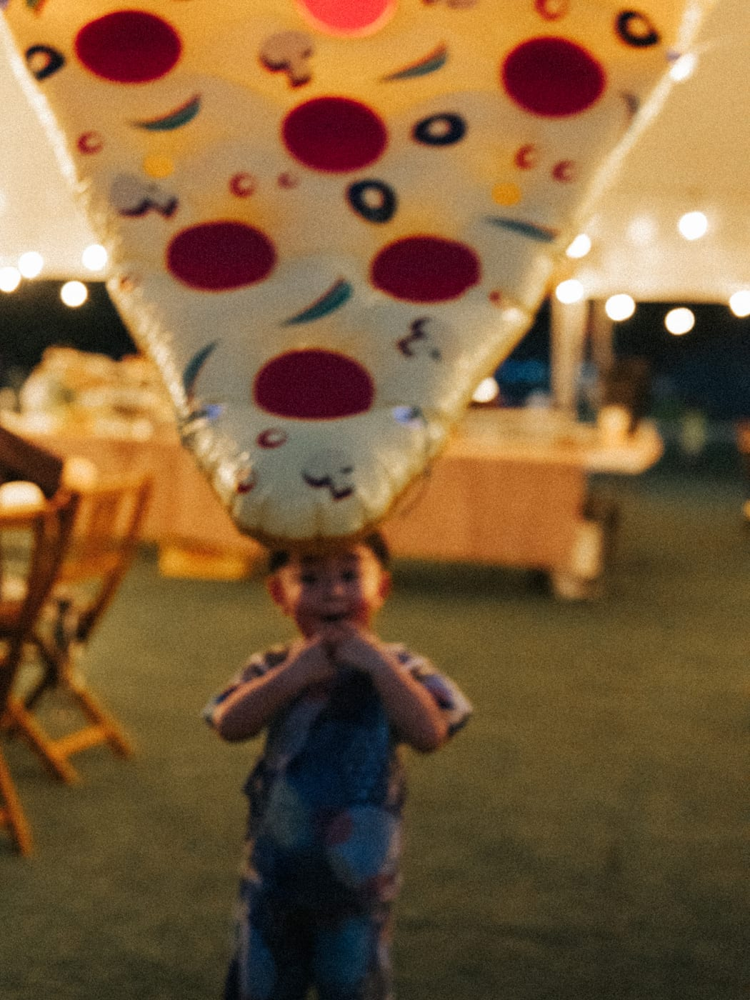
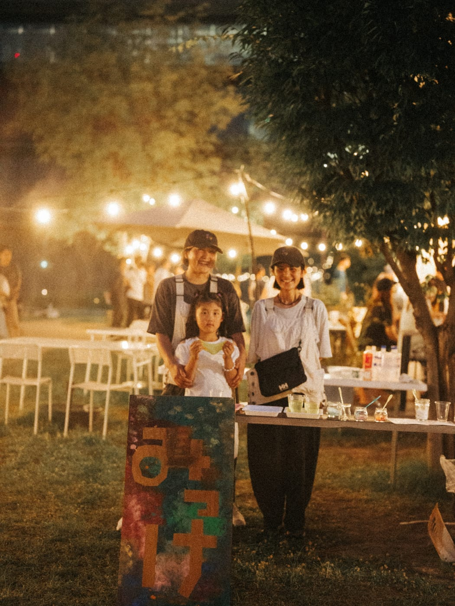
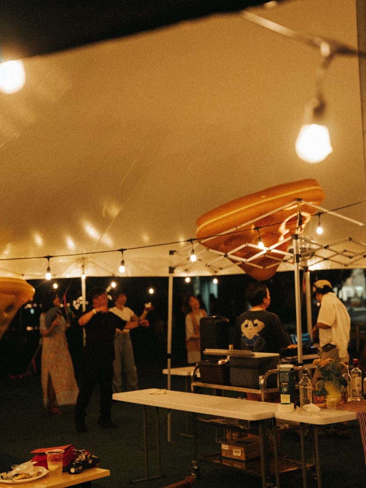

2026年7月18日（土）、福山中央公園で「PARK PIZZA PARTY（PPP）」を開催しました。夏の夕方から夜にかけて、公園の芝生に大型テントを立て、フリーピザとDJの音楽、子ども向けのワークショップを楽しんでいただく一日です。

**推計で約350名**の方にお越しいただきました。

## 開催の記録

| 項目 | 内容 |
|---|---|
| 日時 | 2026年7月18日（土）18:00〜21:00 |
| 会場 | 福山中央公園（屋外・大型テント設営） |
| 主催 | Good Day Neighbors |
| 協力 | みっけ こどものアトリエ／DJ／Enlee |
| 来場者数 | 推計 約350名 |

> 来場者数は、同時開催した子ども向けワークショップの参加者数（114名）をもとにした推計です。正確な入場カウントは行っていません。

## 暑さ対策としての大型テントとミスト

7月の屋外イベントで最大の課題は暑さです。今回は芝生に**大型テントを設営し、あわせてミストを稼働**させました。

テントの日陰とミストがあることで、日中の熱がまだ残る時間帯でも、腰を落ち着けて過ごせる空間になりました。「公園に来たけれど暑くてすぐ帰る」のではなく、**滞在してもらえる場所になった**ことが、今回いちばんの手応えです。

## フリーピザとDJ

数量限定・事前予約制のフリーピザには、**17組のご予約**をいただきました。Enleeによるテイクアウト販売もあわせて行っています。

DJによる音楽が流れる中、ピザ型のバルーンが会場のあちこちに浮かび、夜の公園が普段とは違う表情になりました。

## 子ども向けワークショップ「よるあそび」

みっけ こどものアトリエによる「よるあそびワークショップ」を同時開催しました。

- 光るスライム 500円
- ながれぼし 500円
- ほんわりランタン 1,500円

**114名**のお子さまにご参加いただきました。

## 日が落ちてからの公園

暗くなるにつれて電球に灯りがともり、テントの下は賑やかになっていきました。

日常のなかにある公園が、夜になると人が集まる場所に変わる——GDNが目指している「学びと憩いの公園」の姿が、少しずつ形になってきています。

## 出店・ご協力を検討されている方へ

Good Day Neighborsでは、福山中央公園・KOKONでのイベントに出店・ご協力いただける方を随時ご相談しています。当日の客層や運営体制について詳しくお知りになりたい方は、GDN公式LINEよりお気軽にお問い合わせください。
