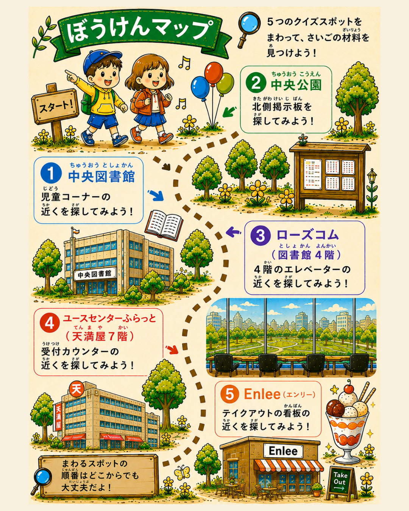
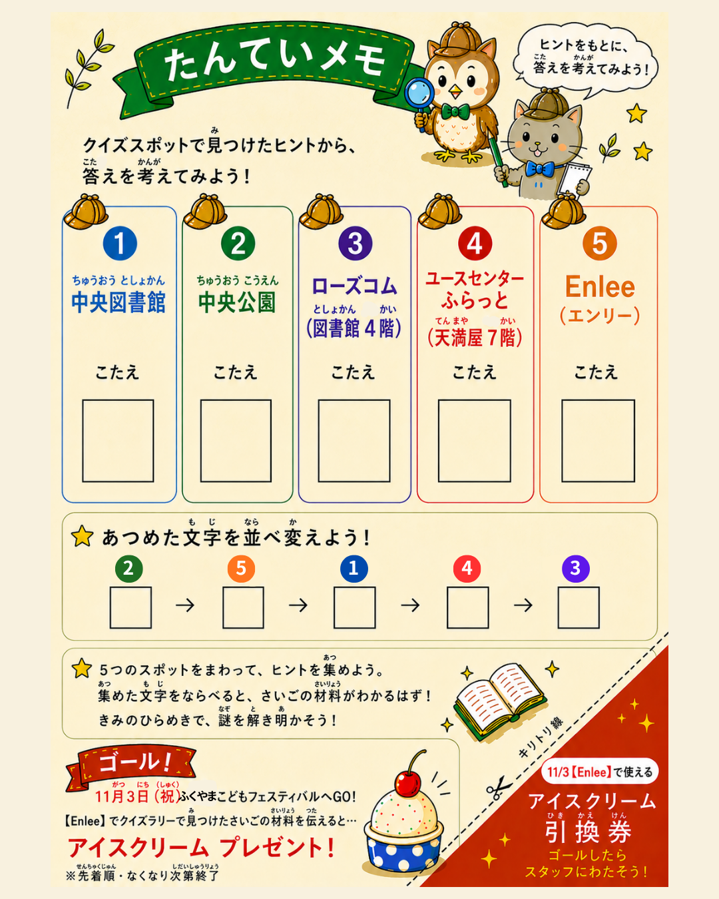

まちが、まるごと探偵の舞台になります。

「まぼろしのレシピ」から、材料がひとつ消えました。福山のまちにある5つのスポットをまわってクイズを解けば、消えた材料がわかるはず。夏休みのおでかけに、まちあるきのきっかけに。親子でぜひ挑戦してみてください。

## 開催概要

- 期間: 2026年8月1日（土）〜10月31日（土）
- 参加費: 無料
- ゴール: 2026年11月3日（祝）ふくやまこどもフェスティバル

## クイズスポット（全5か所）

まわる順番はどこからでも大丈夫です。

1. 中央図書館 — 児童コーナーの近く
2. 中央公園 — 北側掲示板
3. ローズコム（図書館4階） — 4階エレベーターの近く
4. ユースセンターふらっと（天満屋7階） — 受付カウンターの近く
5. Enlee（エンリー） — テイクアウトの看板の近く

1日で全部まわらなくても大丈夫。期間は3か月あるので、おでかけのついでに少しずつでOKです。

## まずは台紙「たんていノート」を

クイズの答えを書き込む台紙は、下記の3か所で配布しています。

- 福山市中央図書館
- Enlee（エンリー）
- ユースセンターふらっと（天満屋7階）

5つのスポットで集めた文字を並べ替えると、さいごの材料がわかるしくみです。

## ゴール特典

11月3日（祝）の「ふくやまこどもフェスティバル」がゴールです。Enleeで「さいごの材料」を伝えてくれた探偵さんに、アイスクリームをプレゼントします。

台紙にはキリトリ線付きの「アイスクリーム引換券」が印刷されています。ゴールしたらスタッフにお渡しください。

> 先着順・なくなり次第終了です。引換券が使えるのは11月3日のみとなります。

## お問い合わせ

福山市中央図書館（福山市霞町一丁目10番1号）
TEL: 084-932-7222

※クイズの設置場所は変更になる場合があります。
